# Archimate-PlantUML

PlantUML macros and includes for creating Archimate Diagrams easily.

 

## Table of Contents
1. [Background](#background)
   - [PlantUML](#plantuml)
   - [ArchiMate](#archimate)
2. [Getting Started](#getting-started)
3. [Usage](#usage)
   - [ArchiMate Elements](#archimate-elements)
   - [ArchiMate Relationships](#archimate-relationships)
   - [ArchiMate Groups](#archimate-groups)
   - [Nesting of Components](#nesting-of-components)
   - [Theme Support](#theme-support)
4. [Example](#example)
5. [Contributing](#contributing)
6. [License](#license)
7. [Acknowledgments](#acknowledgments)

## Background

### PlantUML
[PlantUML](http://en.plantuml.com/) is an open-source project that allows you to create UML diagrams using a simple text language. It utilizes [Graphviz](https://en.wikipedia.org/wiki/Graphviz) for diagram layout, generating images in PNG, SVG, or LaTeX formats.

### ArchiMate
[ArchiMate](http://pubs.opengroup.org/architecture/archimate3-doc/) is an enterprise architecture modeling language that supports the description, analysis, and visualization of architecture across business domains.

ArchiMate offers a common language for describing the construction and operation of business processes, organizational structures, information flows, IT systems, and technical infrastructure. This is just like an architectural drawing in classical building where the architecture describes the various aspects of the construction and use of a building. This insight helps the different stakeholders to design, assess, and communicate the consequences of decisions and changes within and between these business domains. 

[Archimate-PlantUML](https://github.com/plantuml-stdlib/Archimate-PlantUML) combines the benefits of PlantUML and ArchiMate for providing a simple way of creating and managing ArchiMate diagrams. The Archimate-PlantUML is a set of macros and other includes written on top of [PlantUML Archimate specification](http://plantuml.com/archimate-diagram), with an aim to simplify the syntax for creating elements and defining relationships.

## Getting Started
Include the built-in Archimate support in your `.puml` or `.wsd` file:
```plantuml
!include <archimate/Archimate>
```

### Using custom version of the Archimate support
If the built-in version does not suit you, it is possible to refer to a more up to date version of the `Archimate.puml` file. In that case, instead of including `<archimate/Archimate>`, point to the file location of the updated version:

```plantuml
' use the latest version (usually a beta version) from the official PlantUML Stdlib Archimate repo 
!include https://raw.githubusercontent.com/plantuml-stdlib/Archimate-PlantUML/master/Archimate.puml

```

For offline use, download the files and reference them locally:
```plantuml
!include path/to/Archimate.puml
```

## Usage
After you have included `Archimate.puml` you can use the defined macros for ArchiMate elements. 

### ArchiMate Elements
The ArchiMate elements are defined in the following pattern:
```plantuml
Category_ElementName(nameOfTheElement, "description")
```
For example:  
* To define a `Stakeholder` element, which is part of `Motivation` category, the syntax will be
    ```plantuml
    Motivation_Stakeholder(StakeholderElement, "Stakeholder Description")
    ```
    Output:  
    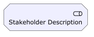
* To define a `Business Service` element,
    ```plantuml
    Business_Service(BService, "Business Service") {
        Application_Service("AppService01", "App Service 01")
        Application_Service("AppService02", "App Service 02")
        Application_Service("AppService03", "App Service 03")
    }
    ```
    Output:  
    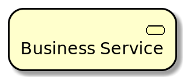 

### ArchiMate Relationships
The ArchiMate relationships are defined with the following pattern:
```plantuml
Rel_RelationType(fromElement, toElement, "description")
```
and to define the direction / orientation of the two elements:
```plantuml
Rel_RelationType_Direction(fromElement, toElement, "description")
```
The `RelationTypes` supported are:
 - Access
 - Aggregation
 - Assignment
 - Association
 - Composition
 - Flow
 - Influence
 - Realization
 - Serving
 - Specialization
 - Triggering

The `Directions` supported are:
 - Up
 - Down
 - Left
 - Right

For example:
* To denote a `composition` relationship between the Stakeholder and Business Service defined above, the syntax will be
    ```plantuml
    Rel_Composition(StakeholderElement, BService, "Description for the relationship")
    ```
    Output:  
    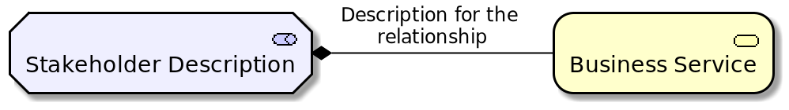
* To orient the two elements in top - down position, the syntax will be
    ```plantuml
    Rel_Composition_Down(StakeholderElement, BService, "Description for the relationship")
    ```
    Output:  
    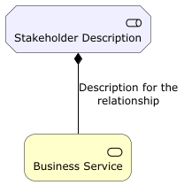

### ArchiMate Groups
Groups in ArchiMate are denoted using the following syntax:
```plantuml
Grouping(nameOfTheGroup, "Group Description"){
    //Define the ArchiMate Elements
}
```
and to define the direction / orientation of the two elements:
```plantuml
Group(nameOfTheGroup, "Group Description"){
    //Define the ArchiMate Elements
}
```
For example
* Group Type 1:
    ```plantuml
    Grouping(Example01, "Group Type 01"){
        Motivation_Stakeholder(StakeholderElement, "Stakeholder Description")
        Business_Service(BService, "Business Service")
    }
    ```
    Output:  
    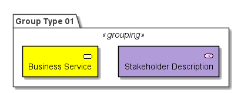

* Group Type 2:
    ```plantuml
    Group(Example01, "Group Type 01"){
        Motivation_Stakeholder(StakeholderElement, "Stakeholder Description")
        Business_Service(BService, "Business Service")
    }
    ```
    Output:  
    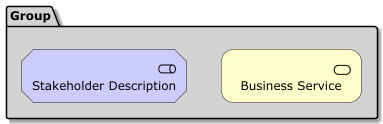

### Nesting of Components
Nesting allows grouping components hierarchically, improving diagram clarity. There are no limitations on the number of levels of nesting.
The implementation allows nesting of any components inside any other components. When nesting, the elements will retain their shape and show nested elements inside their borders.


Nesting is done by placing nested elements within curly braces `{ ... }`:
```plantuml
Category_ElementName(nameOfTheElement, "description") {
    Category_ElementName(uniqueName, "description)
}
```

For example:
```plantuml
Business_Product("BusProduct01", "Business Product 01") {
    Business_Service("BusService01", "Business Service 01")
    Business_Service("BusService02", "Business Service 02")
    Business_Service("BusService03", "Business Service 03")
}

Technology_Device("TechDevice01", "Technology Device 01") {
    Technology_Device("TechDevice02", "Technology Device 02")
    Technology_Device("TechDevice03", "Technology Device 03") {
        Technology_Device("TechDevice04", "Technology Device 04")
        Technology_Device("TechDevice05", "Technology Device 05")
    }
}
```
Output:
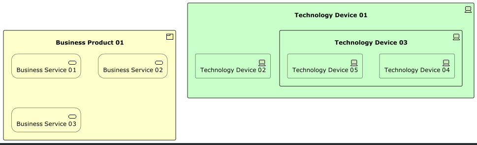
Note that the representation of Technology-Device element changed from a node to rectangle when nesting was enabled.

### Theme Support
Theme support is enabled and 5 variations are available. All the themes are based on Archimate specifications.

Theme can be enabled by adding the following line.
```plantuml
!theme <theme-name> from <theme-folder>

// Example
!theme archimate-saturated from https://raw.githubusercontent.com/plantuml-stdlib/Archimate-PlantUML/master/themes
```

|Theme Name              | Preview                                            |
|------------------------|----------------------------------------------------|
|Default (No line added) | 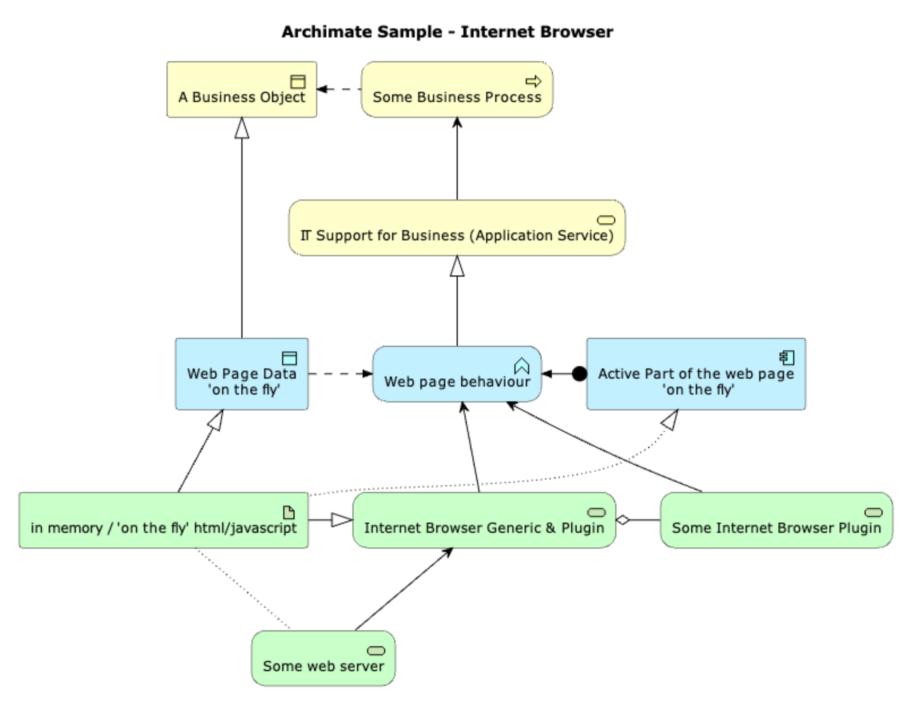             |
|archimate-standard      | 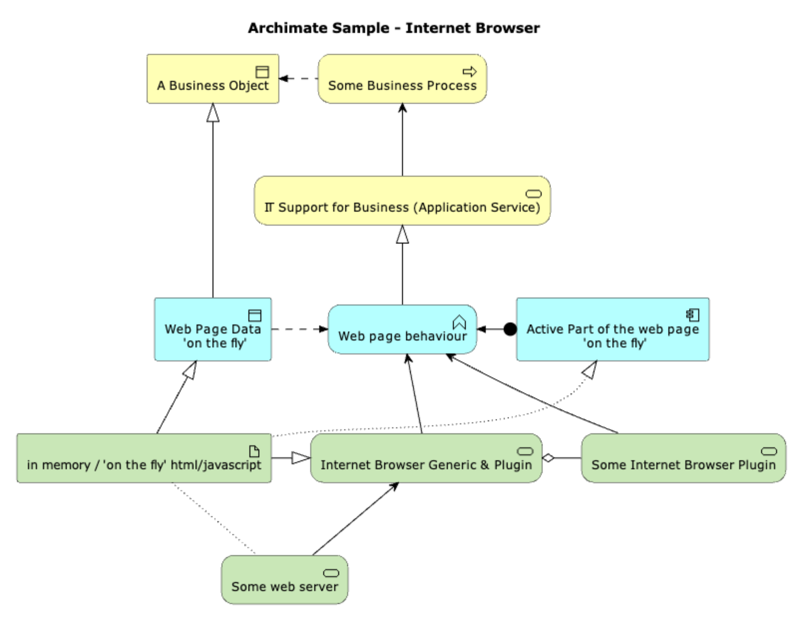           |
|archimate-alternate     | 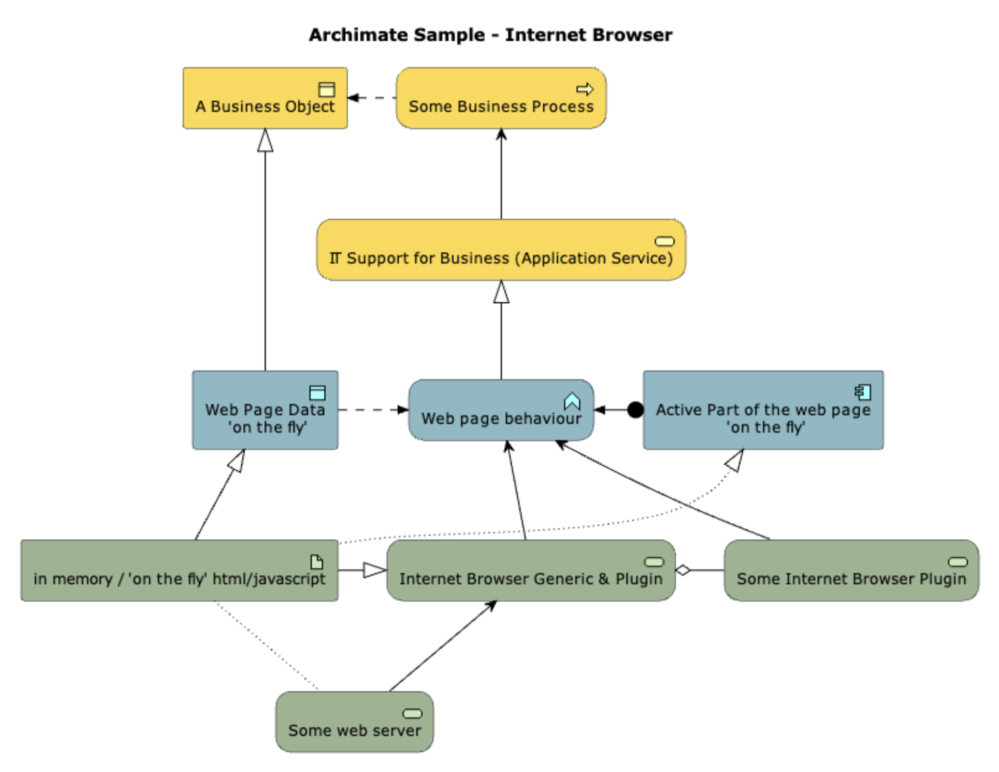         |
|archimate-saturated     | 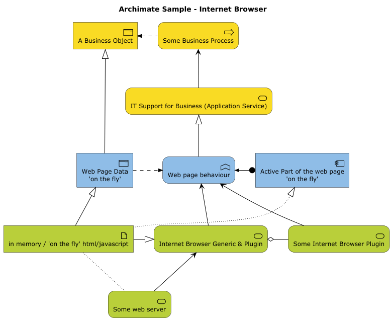         |
|archimate-lowsaturation | 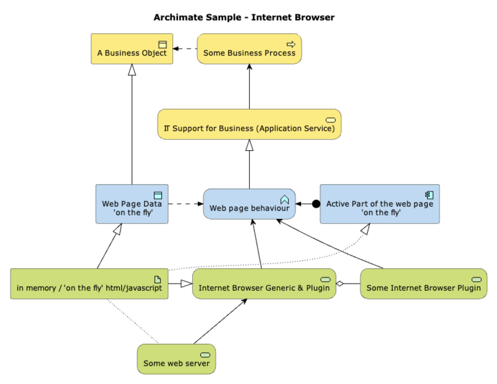 |
|archimate-handwriting   | 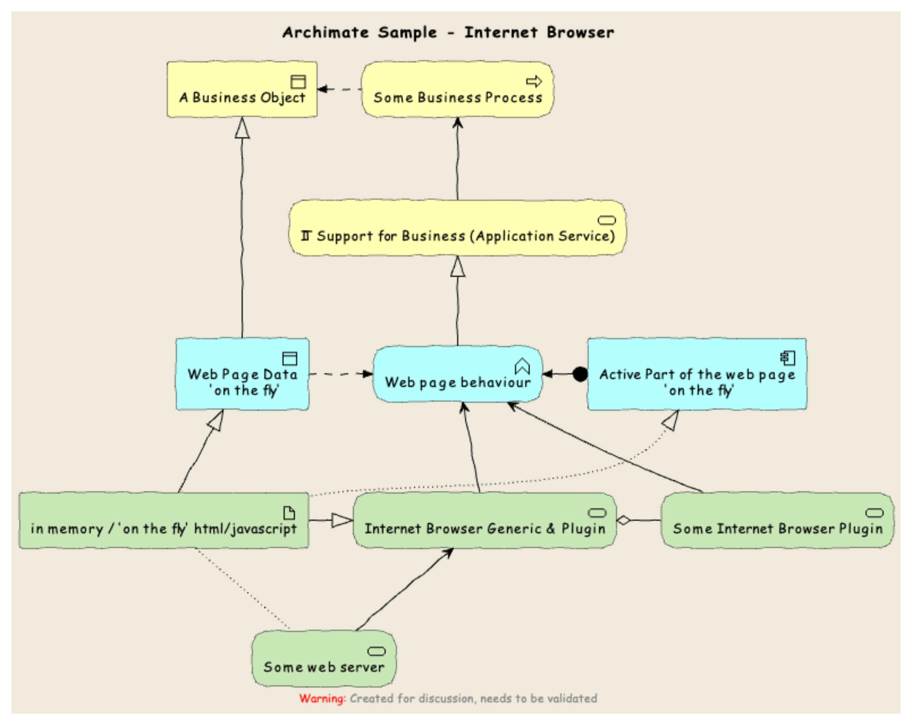     |

## Example
```plantuml
@startuml
!includeurl https://raw.githubusercontent.com/plantuml-stdlib/Archimate-PlantUML/master/Archimate.puml
!theme archimate-standard from https://raw.githubusercontent.com/plantuml-stdlib/Archimate-PlantUML/master/themes

title Archimate Sample - Requirement & Application Services

'Elements'
Motivation_Requirement(ReqPayrollStandard, "Do Payroll with a standard system")
Motivation_Requirement(ReqBudgetPlanning, "Do budget planning within the ERP system")

Application_Service(ASPayroll,"Payroll Service")
Application_Service(ASBudgetPlanning,"Budget Planning Service")
Application_Component(ACSAPFinanceAccRec, "SAP Finance - Accounts Receivables")
Application_Component(ACSAPHR, "SAP Human Resources")
Application_Component(ACSAPFin, "SAP Finance")
Application_Component(ACSAP,"SAP") 

'Relationships'
Rel_Realization_Up(ASPayroll, ReqPayrollStandard)
Rel_Realization_Up(ASBudgetPlanning, ReqBudgetPlanning)
Rel_Realization_Up(ACSAPFinanceAccRec, ASBudgetPlanning)
Rel_Realization_Up(ACSAPHR, ASPayroll)

Rel_Composition_Up(ACSAPFin, ACSAPFinanceAccRec)
Rel_Composition_Up(ACSAP, ACSAPHR)
Rel_Composition_Up(ACSAP, ACSAPFin)
@enduml
```

Output:  
 

## Contributing
If you have any ideas, [open an issue](https://github.com/plantuml-stdlib/Archimate-PlantUML/issues/new) or fork the repository and submit a pull request.

## License
This project is licensed under the MIT License - see the [LICENSE](LICENSE) file for details

## Acknowledgments
* [PlantUML Reference Guide](http://plantuml.com/PlantUML_Language_Reference_Guide.pdf) - PlantUML Reference Guide
* [Archimate 3.1 Specification](http://pubs.opengroup.org/architecture/archimate3-doc/) - Archimate Specifications
* [Plant UML Archimate Specifications](http://plantuml.com/archimate-diagram) - for archimate spec in PlantUML
* [C4-PlantUML](https://github.com/plantuml-stdlib/C4-PlantUML) - for inspiration, base structure and scripts idea
