| Category | Element | Sprite |
| -------- | ------- | ------ |
| Application | Collaboration |  |
|  | Component |  |
|  | DataObject |  |
|  | Event |  |
|  | Function |  |
|  | Interaction |  |
|  | Interface |  |
|  | Process |  |
|  | Service |  |
| Business | Actor |  |
|  | Collaboration | 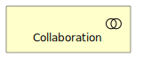 |
|  | Contract |  |
|  | Event |  |
|  | Function |  |
|  | Interaction |  |
|  | Interface |  |
|  | Location | 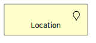 |
|  | Object |  |
|  | Process |  |
|  | Product |  |
|  | Representation |  |
|  | Role |  |
|  | Service |  |
| Group | Group |  |
| Grouping | Grouping |  |
| Implementation | Deliverable |  |
|  | Event |  |
|  | Gap | 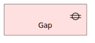 |
|  | Plateau | 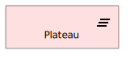 |
|  | WorkPackage | 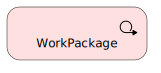 |
| Junction | And |  |
|  | Or |  |
| Motivation | Assessment |  |
|  | Constraint |  |
|  | Driver |  |
|  | Goal |  |
|  | Meaning |  |
|  | Outcome |  |
|  | Principle |  |
|  | Requirement |  |
|  | Stakeholder |  |
|  | Value | 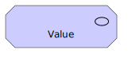 |
| Other | Grouping |  |
|  | Location | 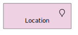 |
| Physical | DistributionNetwork |  |
|  | Equipment | 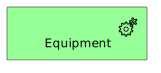 |
|  | Facility | 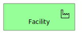 |
|  | Material |  |
| Strategy | Capability |  |
|  | CourseOfAction |  |
|  | Resource |  |
|  | ValueStream |  |
| Technology | Artifact |  |
|  | Collaboration | 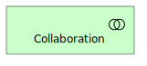 |
|  | CommunicationNetwork | 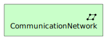 |
|  | Device |  |
|  | Event |  |
|  | Function |  |
|  | Interaction |  |
|  | Interface | 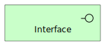 |
|  | Node |  |
|  | Path |  |
|  | Process |  |
|  | Service |  |
|  | SystemSoftware | 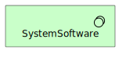 |
